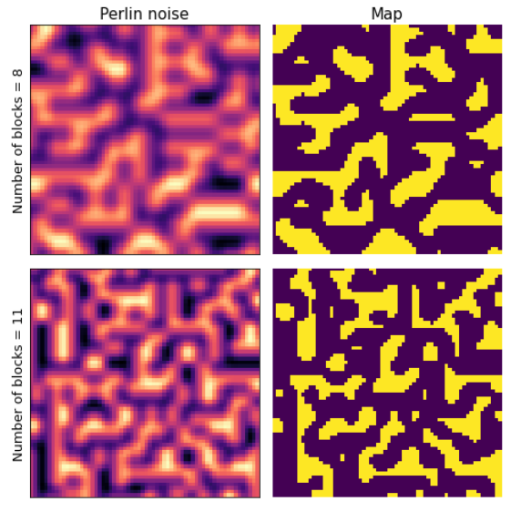
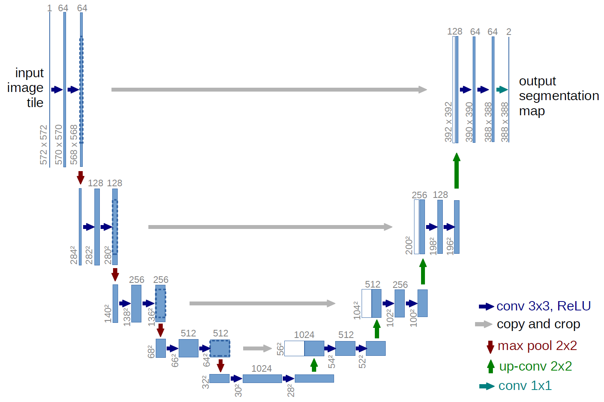
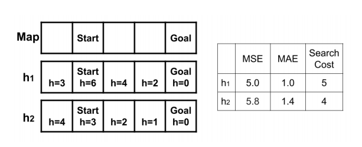
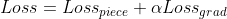
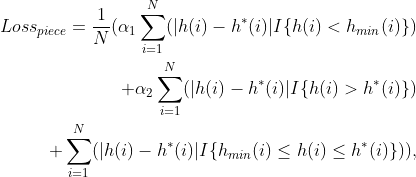
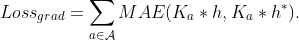

# LearningHeuristicsForPlanning

Этот проект выполнен Латыповой Екатериной (latypova.ea@phystech.edu) и 
Шарыпиной Дарьей (sharypina.dv@phystech.edu) в рамках курса "Эвристические методы планирования" в МФТИ на основе статьи [Learning Heuristic Functions for Mobile Robot Path Planning Using Deep Neural Networks](https://ojs.aaai.org/index.php/ICAPS/article/view/3545/3413).

# Содержание
1. [Мотивация](#introduction)
2. [Метод исследования](#paragraph1)
    1. [Используемые данные](#subparagraph1)
    2. [Исследуемые архитектуры](#subparagraph2)
    3. [Оценивание результатов](#subparagraph3)
3. [Результаты](#paragraph2)
4. [Быстрый старт](#paragraph3)

## Мотивация исследования <a name="introduction"></a>
Для алгоритмов эвристического поиска важно, насколько хорошо используемая эвристическая функция аппроксимирует истинную стоимость пути до целевой точки. 
Главной задачей является получение эвристической функции, минимизирующей стоимость поиска.
Интересно проверить, можно ли для данной карты сгенерировать эвристику, которая минимизирует стоимость поиска.

## Метод исследования <a name="paragraph1"></a>

### Используемые  данные <a name="subparagraph1"></a>
Карты для обучения генерировались с использованием шума Перлина. 
Сначала генерируется изображение с шумом, которое затем бинаризуется 
с помощью заданного порога. Т.е. если значение пикселя больше, чем пороговое,
 то значение пикселя становится 1, и этот пиксель будет препятствием, 
 иначе - значение пикселя будет 0, а пискель соответствует свободной 
 точке карты. Кроме порогового значения использовался еще параметр, 
 который влияет на размер препятствий на карте: при генерации шума 
 используется заданное число блоков для разбиения. 
 Чем больше количество блоков, тем мельче в итоге будут препятствия 
 на карте. Примеры сгенерированного шума и полученых карт для 
 разных значений этого параметра приведены на рисунке.



Всего было сгенерировано 1000 карт, для каждой из них сгенерировано 
10 целевых точек. Для каждой из целевых точек запускался алгоритм 
Дейкстры для того, чтобы получить целевую эвристику (т.е. "идеальное" значение эвристики в каждой точке).

### Исследуемые архитектуры <a name="subparagraph2"></a>


Так же как и в [статье](https://ojs.aaai.org/index.php/ICAPS/article/view/3545/3413), за основу была взята архитектура UNet.
Однако в оригинальной работе UNet был модифицирован так, что в одном блоке были использованы только 
одна свертка, а также LeakyReLU, AveragePooling вместо ReLU, MaxPooling соответственно. 
Нами была использована архитектура, отличающаяся от оригинальной только добавлением padding 
для всех сверток, чтобы не приходилось делать crop. 

Сеть исследовалась в двух вариантах: оригинальная конфигурация с  вышеупомянутыми изменениями,
а также урезанная сеть такой же структуры, в которой оставлено только 3 блока, т.е. 
максимальное количество каналов составляло 256, а не 1024, как в оригинальной модели.

Исходный код моделей может быть найден в файле ```models.py```.
### Обучение сети <a name="subparagraph3"></a>
В оригинальной статье подробно рассмотрен вопрос важности функции потерь. 
При обучении сети решается задача минимизации функции потерь, зависящей от выхода нейронной сети и целевой переменной.
В нашем случае целевой переменной является "идеальная эвристика", полученная с помощью алгоритма Дейкстры.

Несмотря на то, что выход функции является вещественным, использование стандартных функций потерь 
MAE/MSE может не привести к минимизации функции поиска. 

Рассмотрим следующий пример



На картинке представлена одномерная карта, 2 эвристики, а значения MSE/MAE для данных эвристик, 
а также стоимость поиска с использованием данных эвристик. Видно, что по метрикам MSE/MAE
первая эвристика лучше приближает "идеальную" эвристику, однако стоимость поиска для нее получается больше.
В данном случае причиной этого является то, что 2 эвристика правильно оценивает увеличение/уменьшение 
эвристической функции при переходе из одной клетки в другую (эвристика для крайней левой клетки должна быть
больше, чем для стартовой точки). Для того чтобы штрафовать за подобные случаи
в функцию потерь вводится компонента, отвечающая за неправильное изменение эвристики при
переходе из одной клетки в другу. Она вычисляется как абсолютная ошибка между свертками фильтров,
отвечающих за возможные направления движения. Подробнее можно посмотреть  в файле ```models.py``` 
(функция ```gradient_loss```).

Кроме того, к полученной эвристике разумно предъявить еще следующие требования:
* допустимость эвристики для нахождения оптимального решения
* эвристика не должна быть меньше минимального разумного предела (мы использовали обычное евклидово расстояние)

Такие рассуждения приводят нас к еще одной компоненте функции потерь, представляющей 
собой абсолютную ошибку, где ошибки трех типов: меньше минимального предела, 
переоценивание эвристики, промежуточный результат взвешены с различными весами. Подробнее можно посмотреть  в файле ```models.py``` 
(функция ```piece_loss```).

Итоговая функция потерь может быть найдена по формулам







## Результаты <a name="paragraph2"></a>
НУЖНЫ РЕЗУЛЬТАТЫ

## Быстрый старт <a name="paragraph3"></a>
Сгенерированный нами датасет может быть найден по ссылкам
* [карты](https://drive.google.com/file/d/1u_KpcYIq7XIODcBvtec5PdME2gwJypY2/view?usp=sharing)
* [эталонные эвристики](https://drive.google.com/file/d/1aVtpyf5NXFi6ECS376mvOH0sLdfP5ajf/view?usp=sharing)
* [цели, для которых были посчитаны эвристики](https://drive.google.com/file/d/1UDR-4WwMZUbLAOZrkdPP8XcPciM3saNV/view?usp=sharing)
* [соотнесение между названиями файлов с картами и эвристиками/целями для них](https://drive.google.com/file/d/1SWoNxrDHSamEtHA6rwVegB-YaZB-Ac5t/view?usp=sharing)

Подробнее структуру датасета можно изучить в файле ```utils.py```

После скачивания файлов их можно разархивировать

```
tar -xf heuristic_structured.tar.gz
tar -xf goal_structured.tar.gz
tar -xf map.tar.gz
```
Скачать код для обучения моделей
```
wget https://github.com/katyalatypova/LearningHeuristicsForPlanning/archive/refs/heads/main.zip
unzip main.zip
```
Пример скрипта для обучения модели (подробнее об аргументах в ```train.py```)

```
python3 LearningHeuristicsForPlanning-main/train.py \
  --model_type big \
  --map_dir map \
  --goal_dir goal_structured \
  --heuristic_dir heuristic_structured \
  --map_to_heuristic data.json \
  --output_dir results \
  --alpha 1.0 \
  --alpha1 1.0 \
  --alpha2 10.0 \
  --batch_size 64 \
  --learning_rate 1e-3 \
  --desired_batch_size 64 \
  --num_train_epochs 20 
```

После обучения можно сгенерировать визуализацию для 100 картинок из датасета

```
python3 LearningHeuristicsForPlanning-main/visualize_results.py \
  --model_type big \
  --map_dir map \
  --goal_dir goal_structured \
  --heuristic_dir heuristic_structured \
  --map_to_heuristic data.json \
  --output_dir results/figures \
  --checkpoint_path results/checkpoit_epoch_20
```

Также можно собрать статистику для обученной модели

```
python3 LearningHeuristicsForPlanning-main/evaluate_stats.py \
  --model_type big \
  --map_dir map \
  --goal_dir goal_structured \
  --heuristic_dir heuristic_structured \
  --map_to_heuristic data.json \
  --output_dir results/stats \
  --checkpoint_path results/checkpoit_epoch_20 \
  --max_size 1000
```

Собрать статистику для тех же данных для известных эвристик

```
python3 LearningHeuristicsForPlanning-main/evaluate_stats_without_net.py \
  --map_dir map \
  --goal_dir goal_structured \
  --heuristic_dir heuristic_structured \
  --map_to_heuristic data.json \
  --output_dir results/stats_chebyshev \
  --max_size 1000 \
  --heuristic_type chebyshev 
```
